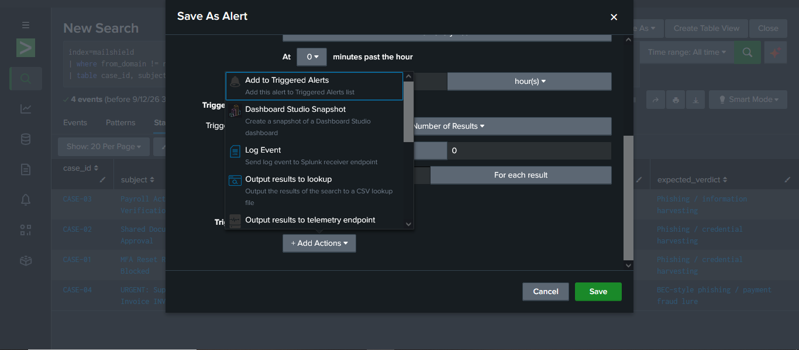
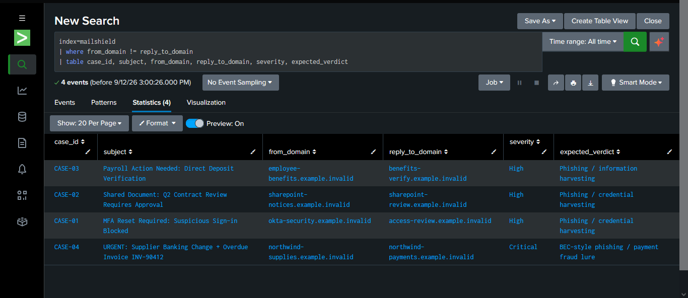
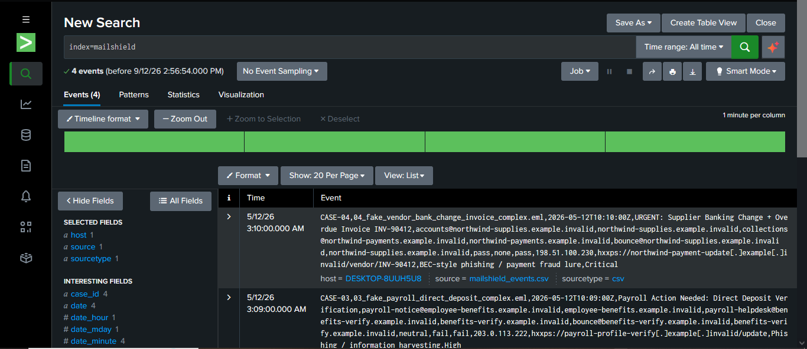
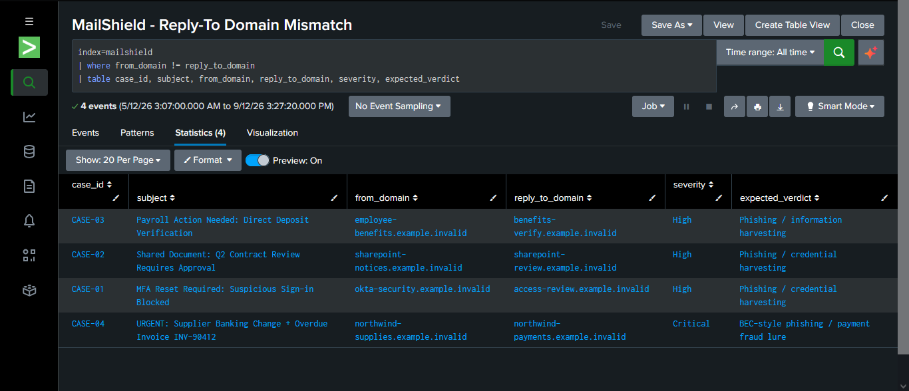

# Detection 1: Reply-To Domain Mismatch

## Objective
Identify emails where the sender's domain (`From`) does not match the domain
the reply is routed to (`Reply-To`). This is a common phishing/BEC technique:
attackers spoof a trusted `From` address but route replies to a domain they
actually control, since they can't receive mail at the spoofed domain.

## Logic
Compare the `from_domain` and `reply_to_domain` fields extracted from each
email event. Flag any event where they differ.

## SPL
```spl
index=mailshield
| where from_domain != reply_to_domain
| table case_id, subject, from_domain, reply_to_domain, severity, expected_verdict
```

- `index=mailshield` — scope to this project's data
- `where from_domain != reply_to_domain` — keep only mismatched events
- `table ...` — display as a clean, readable list

## Test Data
4 synthetic phishing emails (`data/synthetic_emails/`), flattened into
`data/sample_events/mailshield_events.csv`.

## Expected Result
All 4 cases match — every email in this dataset has a Reply-To mismatch.

| case_id | from_domain | reply_to_domain | severity |
|---|---|---|---|
| CASE-01 | okta-security.example.invalid | access-review.example.invalid | High |
| CASE-02 | sharepoint-notices.example.invalid | sharepoint-review.example.invalid | High |
| CASE-03 | employee-benefits.example.invalid | benefits-verify.example.invalid | High |
| CASE-04 | northwind-supplies.example.invalid | northwind-payments.example.invalid | Critical |

## Alert Configuration
- **Name**: `MailShield - Reply-To Domain Mismatch`
- **Schedule**: Hourly
- **Trigger condition**: Number of Results > 0
- **Action**: Add to Triggered Alerts
- **Time range**: All time (`dispatch.earliest_time=0`, `dispatch.latest_time=now`)
  — set via Advanced Edit after the standard Save As Alert dialog didn't
  persist "All time" correctly (see Troubleshooting).

## Evidence

Detection logic run as an ad-hoc search, returning all 4 known-bad cases:



Saved as a scheduled alert, with "Add to Triggered Alerts" as the action:



The saved alert re-run, confirming the same 4 results persist correctly:



Underlying raw event data, confirming genuine structured CSV ingestion
(not just a display artifact of the `table` command):



## False Positive Considerations
Legitimate mail sometimes has a genuinely different Reply-To domain by design
— for example, a company using a third-party mailing/marketing platform
(`noreply@company.com` replying to `support@mailplatform.com`), or a
helpdesk ticketing system. This detection is best used as a *risk signal*
to combine with other indicators (urgency language, authentication failures,
external sender), not as a standalone verdict.

This dataset currently has no legitimate/clean sample, so this detection has
only been validated against known-malicious data — it has not yet been
proven to avoid false positives on real everyday mail. Noted as a limitation.

## What I Learned
- Splunk's "Save As Alert" dialog does not always reliably persist "All time"
  as the alert's search window — it silently defaulted to "Last 1 hour" even
  after being changed in the search bar. Fixed via Advanced Edit by setting
  `dispatch.earliest_time=0` and `dispatch.latest_time=now` directly.
- Saving a structured CSV source type under a new custom name can silently
  drop the CSV parsing settings if the Delimited Settings fields aren't
  explicitly confirmed first — reverting to raw line-by-line ingestion.
