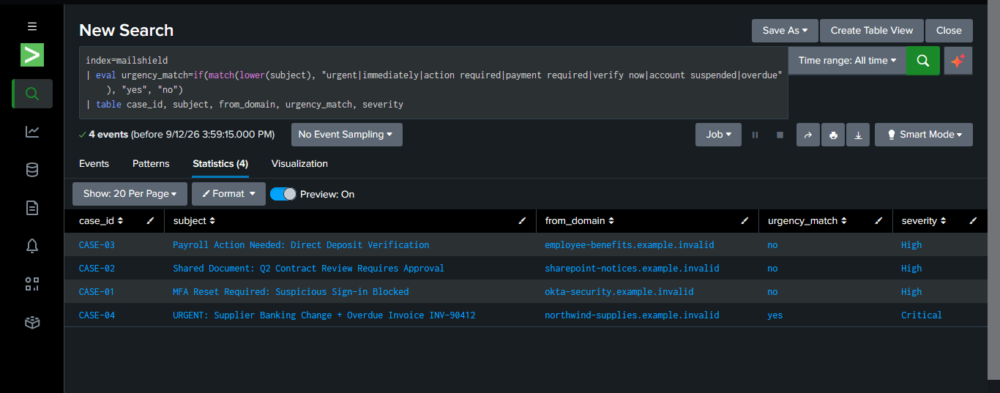
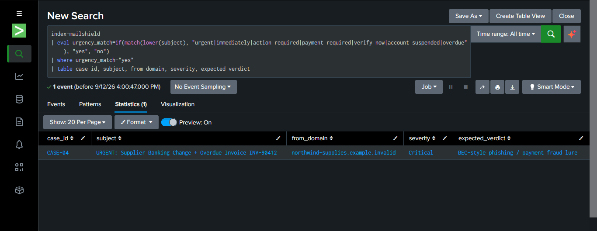
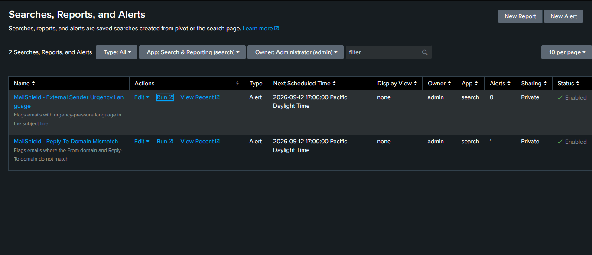
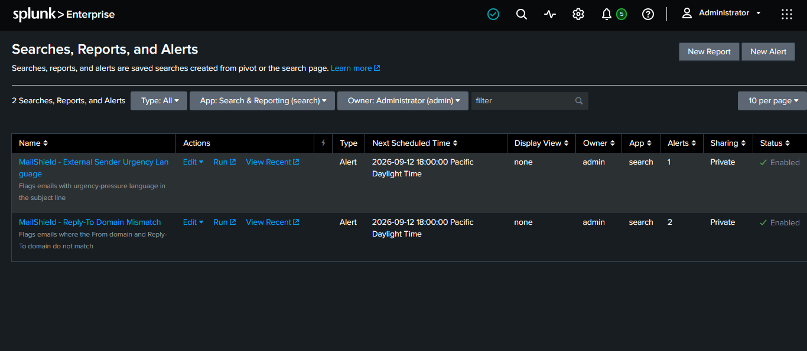

# Detection 2: External Sender + Urgency Language

## Objective
Flag emails that combine an external sender with urgency-pressure language
in the subject line. Neither signal alone is a reliable indicator, since
urgency wording alone is common in legitimate mail, and most mail is
external by default, but the combination is a recognizable
social-engineering pattern: attackers manufacture time pressure
specifically to short-circuit careful review.

## Logic
Search the `subject` field (case-insensitive) for a list of urgency-related
terms. Flag matches.

## SPL
```spl
index=mailshield
| eval urgency_match=if(match(lower(subject), "urgent|immediately|action required|payment required|verify now|account suspended|overdue"), "yes", "no")
| where urgency_match="yes"
| table case_id, subject, from_domain, severity, expected_verdict
```

- `eval urgency_match=if(match(...), "yes", "no")`: creates a field flagging
  whether the subject contains any urgency term
- `lower(subject)`: case-insensitive matching
- `where urgency_match="yes"`: keep only matches
- `table ...`: clean display

## Test Data
Same 4-case dataset as Detection 1 (`data/sample_events/mailshield_events.csv`).

## Expected Result
1 match: **CASE-04** ("URGENT: Supplier Banking Change + Overdue Invoice
INV-90412"). The other 3 cases use softer phrasing ("Action Needed,"
"Requires Approval") that correctly does not trigger this word list.

| case_id | subject | severity |
|---|---|---|
| CASE-04 | URGENT: Supplier Banking Change + Overdue Invoice INV-90412 | Critical |

## Alert Configuration
- **Name**: `MailShield - External Sender Urgency Language`
- **Schedule**: Hourly (`cron_schedule = 0 * * * *`)
- **Trigger condition**: `alert_comparator = greater than`, `alert_threshold = 0`
- **Action**: Add to Triggered Alerts
- **Time range**: All time (`dispatch.earliest_time=0`, `dispatch.latest_time=now`)
- **Confirmed firing**: scheduler log, `status=success`, `result_count=1`
  at the 18:00 hourly run

## Evidence

The `urgency_match` logic evaluated across all 4 cases. Only CASE-04 flags
`yes`, the other 3 correctly show `no`:



The final filtered detection query, returning just the one true positive:



Before the scheduled alert had fired, Alerts count at 0:



After the real scheduled (cron) run executed, Alerts count confirmed at 1:



## False Positive / Limitation Considerations
- **"External sender" is not actually implemented as a comparison yet.**
  Every email in this dataset comes from an `.example.invalid` domain, so
  there's no internal/company domain to compare against. This detection
  currently only checks urgency language. The "external" half of its name
  describes the intended real-world use case, not logic this dataset can
  currently test. A real deployment would compare sender domain against a
  known list of internal/trusted domains.
- Urgency word lists are inherently guessable/gameable by attackers who
  vary phrasing. This is a starting signal, not a complete defense.
- No clean/legitimate sample exists yet in this dataset to test false
  positives against normal business urgency language (e.g. genuine deadline
  reminders).

## What I Learned
- **Manually clicking "Run" on a saved search does not trigger the alert
  action or appear in Triggered Alerts.** Only a genuine scheduled
  (cron-driven) execution does. This wasn't obvious from the UI and cost
  significant troubleshooting time; the only reliable way to verify an
  alert actually fires is to check Splunk's own scheduler log
  (`index=_internal sourcetype=scheduler`) or wait for a real scheduled run.
- Editing `cron_schedule` via Advanced Edit did not reliably take effect
  in this environment even after multiple save attempts and a UI refresh,
  confirmed via the scheduler log showing zero execution attempts despite
  the change appearing saved. Reverted to the original hourly schedule and
  let the real clock confirm it instead of forcing a faster test cycle.
