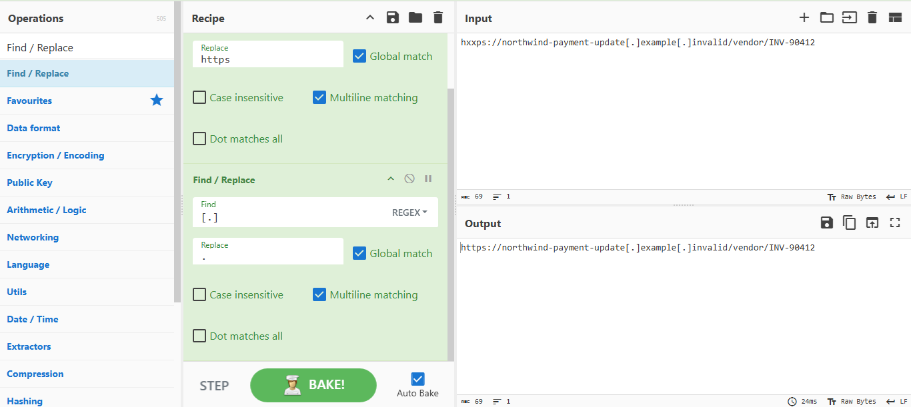
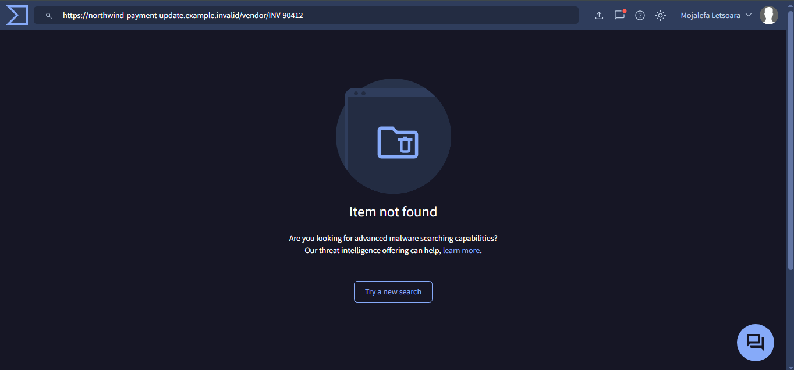

# CASE-04 Incident Investigation: Vendor Bank Change / BEC

## Incident Lifecycle
Detect, Validate, Investigate, Enrich, Risk Score, Respond, Close.

This document covers the first four stages (Detect through Enrich). Risk
Score, Respond, and Close will be added once the risk scoring model is
built.

## 1. Detect

Two independent detections fired on this case:

- **Detection 1, Reply-To Domain Mismatch**: `from_domain` is
  `northwind-supplies.example.invalid`, `reply_to_domain` is
  `northwind-payments.example.invalid`. Different domains, mismatch flagged.
  Full write-up: [`detection-1-reply-to-mismatch.md`](../detections/detection-1-reply-to-mismatch.md)
- **Detection 2, External Sender Urgency Language**: subject line contains
  "URGENT" and "Overdue," matched the urgency word list.
  Full write-up: [`detection-2-urgency-language.md`](../detections/detection-2-urgency-language.md)

Two independent detections agreeing on the same case is itself a useful
signal. It's not a coincidence, it's the kind of corroboration that raises
confidence before any enrichment even happens.

## 2. Validate

Reading the raw email content (`data/synthetic_emails/04_fake_vendor_bank_change_invoice_complex.eml`)
confirms this is a genuine true positive, not a detection artifact:

- **Subject**: "URGENT: Supplier Banking Change + Overdue Invoice INV-90412"
- **Claimed sender**: `accounts@northwind-supplies.example.invalid`, styled
  as a known vendor
- **Request**: change banking/payment details and settle an "overdue"
  invoice, routed through a different Reply-To domain
  (`northwind-payments.example.invalid`)

This matches a textbook Business Email Compromise (BEC) vendor-impersonation
pattern: spoof a trusted-looking vendor identity, manufacture urgency, and
redirect payment. The dataset's own `manifest.csv` and `mailshield_events.csv`
independently label this case `expected_verdict = BEC-style phishing /
payment fraud lure`, `severity = Critical`, consistent with this reading.

## 3. Investigate and Enrich

### IOCs identified

| IOC | Type | Value |
|---|---|---|
| Originating IP | IPv4 | `198.51.100.230` |
| Embedded URL | URL (defanged in source) | `hxxps://northwind-payment-update[.]example[.]invalid/vendor/INV-90412` |

### IOC 1: Originating IP, checked in AbuseIPDB

**Why this tool**: AbuseIPDB is the right choice specifically for IP
reputation and abuse history, per the project's tool-selection rule (use
the tool that fits the indicator, not every tool on everything).

**Result**: AbuseIPDB itself flags `198.51.100.230` as a private/reserved
address and states the reports on that page are shown "for entertainment
and testing purposes only." One report exists: 11 months old, single
source (`cheatmaster.store`), category `SSH` (brute-force login attempts).

**Interpretation**: this is correctly read as *no meaningful signal*, not
as "clean" and not as "malicious." Three things point to that reading:
the platform's own disclaimer, the report's age and single-source nature,
and the category (`SSH`) having nothing to do with an email/BEC scenario.
This is also the expected outcome by design: `198.51.100.230` sits in the
RFC 5737 documentation address range, reserved specifically so it can
never be a real, routable internet host.

### IOC 2: Embedded URL, refanged in CyberChef, then checked in VirusTotal

**Why CyberChef first**: the URL is intentionally defanged in the raw data
(`hxxps`, `[.]`) so it can't be accidentally clicked or auto-linked. It has
to be refanged into a real URL string before any lookup tool can parse it.

**First attempt, and the bug in it**:

The recipe used two Find/Replace steps: `hxxps` to `https`, and `[.]` to
`.`. The first step worked. The second was set to **REGEX** mode, and in
regex syntax, `[.]` means "match one literal period" (square brackets
define a character class), so it matched only the `.` character and left
the surrounding `[` and `]` brackets untouched. Output stayed malformed:
`https://northwind-payment-update[.]example[.]invalid/...`. Feeding that
into VirusTotal caused it to fail parsing the string as a URL and fall
back to a text search, landing on an empty "Comments" tab instead of a
real analysis.

**Fix**: switch that second Find/Replace step from REGEX mode to **Simple
string** mode, so `[.]` is matched as the literal three characters
`[`, `.`, `]` rather than as a regex pattern. Corrected output:
`https://northwind-payment-update.example.invalid/vendor/INV-90412`.

**VirusTotal result on the corrected URL**:

**Interpretation**: "Item not found" is the correct, expected result here.
The domain uses `.invalid`, a TLD reserved by RFC 2606 specifically so it
can never resolve on the real internet. No scanner has ever been able to
crawl or score it, because it has never existed as a live target.

### What a genuine positive would look like, for contrast

Since every check here correctly returned "no data" rather than a real
verdict, it's worth documenting what the same tools show on *actual*
malicious infrastructure, so the difference between "clean," "malicious,"
and "no data exists to judge from" is explicit rather than assumed:

| Signal | This investigation (synthetic) | Typical real malicious indicator |
|---|---|---|
| VirusTotal detections | Item not found | Tens of security vendors flagging it, red banner, `phishing`/`malware` tags |
| VirusTotal history | None, domain never existed | First-seen date, often very recently registered |
| AbuseIPDB reports | 1 report, 11 months old, unrelated category | Dozens to hundreds of reports, recent (hours/days old) |
| AbuseIPDB confidence score | Not applicable (reserved range) | Often 90%+ for established malicious infrastructure |
| AbuseIPDB category match | `SSH` (unrelated to this case) | Categories matching the actual attack (`Phishing`, `Web App Attack`) |

## 4. Risk Score
Not yet completed. Will be added once the project's risk scoring model
is built.

## 5. Respond
Not yet completed.

## 6. Close
Not yet completed.

## What I Learned
- CyberChef's Find/Replace has separate REGEX and Simple string modes, and
  they are not interchangeable for patterns containing regex metacharacters
  like `[` and `]`. A "successful bake" (no error shown) does not mean the
  output is correct, each step's output needs to be checked against what
  was actually expected, not just trusted because nothing turned red.
- Reputation lookups on synthetic or documentation-range data return "no
  data available," not "clean." Treating the absence of data as a clean
  verdict is a real beginner mistake, and the distinction matters: "clean"
  is a finding, "no data" is the absence of one.
